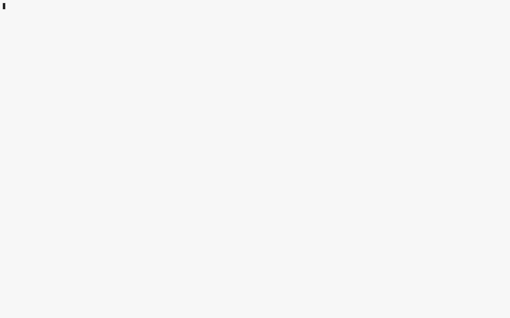

# Tile Traffic

A TUI for quickly generating HTTP requests of map tiles
and tracking their response statistics.

## Example



## Usage
```
$ tile-traffic --help
tile_traffic 

USAGE:
    tile-traffic [OPTIONS] --lat <LAT> --lon <LON>

OPTIONS:
    -b, --bursts <BURSTS>
            Number of bursts [default: 16]

    -h, --help
            Print help information

        --header <HEADER>
            Track the value of an HTTP response header

        --lat <LAT>
            Latitude

        --lon <LON>
            Longitude

    -r, --requests-per-burst <REQUESTS_PER_BURST>
            Number of requests per burst [default: 16]

        --sleep-ms <SLEEP_MS>
            Sleep for a while between bursts, ms [default: 10]

        --wms <WMS>
            WMS template

        --zoom <ZOOM>
            Starting zoom level (most zoomed in) [default: 15]

        --zxy <ZXY>
            ZXY template
```
